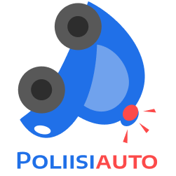

## Important notice!

**This application is a prototype and must not be used in practice under any circumstances! The developers of this application do not take any responsibility, legal or other, of using this application!**

---

# Poliisiauto mobile app

This project is a client application for [PoliisiautoServer](https://github.com/Spacha/PoliisiautoServer). It is an application where users can report bullying to a trusted adult.

## Getting started

This project is made using [Flutter](https://docs.flutter.dev/) and is targeted mainly to Android, but should also work on iOS. Flutter offers a good documentation on how to set up a development environment for it. We recommend using Visual Studio Code with Flutter extension(s) since it has proven to be a very well functioning setup.

You'll also need a device to test on. Most likely you want to use an Android emulator running on the same machine as the editor. Flutter documentation has a tutorial for setting up Android Studio for that purpose.

## License

PoliisiautoApp is licensed under a 2-clause BSD license. See [LICENSE](LICENSE) for more details.
